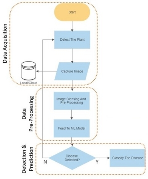

# Prediction and Analysis of Crop Related Diseases on Farmland using a Rover and Machine Learning

(Unpublish Drafted Paper: For Project Reference Only)

1 Aditya Iyer, 2 Akash Suresh, 3 Aryan Jain, 4 Kushal J 

5 Dr. Gayathri KM , 6 Mrs. K Sudha Deepthi,

1,2,3,4 UG BE Final Year ECE Student, Dept of ECE, Dayananda Sagar University (DSU), Bangalore, Karnataka

5 Associate Professor, ECE Dept, School of Engineering,  Dayananda Sagar University, Bangalore, Karnataka

6 Assistant Manager and Certified Trainer, Rexroth Bosch, School of Engineering, Dayananda Sagar University, Bangalore, Karnataka

***Abstract* — Agriculture is an important part of our community as it provides us with our essential staples for living. Some of those essential commodities include rice, corn, vegetables and fruits. These are just some of the basic outputs from agriculture. Hence it is important to empowering small holder farmers through this project. The project focuses on detecting and diagnosing plants on the various diseases they might suffer from. Early detection of these diseases can reduce the likelihood of crops dying. At the same time, it will reduce the risk of the diseases being transferred to other crops. In this project we are providing farmers with a rover that helps him find diseased crops on his land without him personally inspecting his plants. This in turn reduces the work load on the farmer. To obtain the desired results we used the Rocker Bogie Rover design for the rover as it is fully capable of traversing most of the terrain it encounters. For the detection of diseases, we have implemented the Complex Neural Network (CNN) Machine Learning algorithm along with Image Processing.** 

Keywords—Agriculture, Rover, Plants, Diseases, Healthy, Early Blight, Late Blight, Septoria, Mold, Yellow Virus, Mosaic Virus, Bacterial Spot, Algorithm, AI, ML, DL.

1. # 1. Introduction Remarks
The objective of the project is to build an unmanned robotic vehicle which is able to go to different parts of farmland, this eliminates the need for the farmer to oversee his crops manually. The Rover will be equipped with a camera module which automatically identifies and classifies various plants and its diseases by making use of Machine Learning and Image Processing techniques. This will allow the farmer to identify unhealthy plants and take the necessary steps. After conducting some research on the types of terrain the Rover must encounter, it was found that the Rocker-Bogie suspension type was best suited for this application as its design as it has two fixed fulcrums and one dynamic point which allows for a wave-like motion. The reason this domain for this project was chosen was our collective interest in Machine Learning and Mobility.

` `The fact that machines can learn from data, make decisions and its limitless real-time applications exist in almost every domain. We decided to keep our project around ML and Micro-Controller programming to give us time to learn and confirm our interest in it. Taking the opportunity to construct a rover with a unique suspension system to traverse almost every terrain is a challenge in itself and one that we welcome as it gives us a chance to learn something that's outside our current domain of study. We choose agriculture as our domain of operation as it allows us to contribute to the preservation of nature. Detection of diseases in plants early will lead to better overall yield of crops and if the diseases are of a communicable nature, it can be prevented post haste before any actual damage is done.

2. # 2. Motivation Obtained For Taking Up The Work
The reason this domain for our project was chosen was our collective interest in Machine Learning. The fact that machines can learn from data, make decisions and its limitless real-time applications exist in almost every domain. We decided to keep our project around ML and Micro-Controller programming to give us time to learn and confirm our interest in it. Taking the opportunity to construct a rover with a unique suspension system to traverse almost every terrain is a challenge in itself and one that we welcome as it gives us a chance to learn something that’s outside our current domain of study. We choose agriculture as our domain of operation as it allows us to contribute to the preservation of nature. Detection of diseases in plants early will lead to better overall yield of crops. Making use of technology such as this will give educate the farmers about the existing technology.

3. # 3. Objectives
The objective of the project is to build an unmanned robotic vehicle which is able to go to different parts of farmland, this eliminates the need for the farmer to oversee his crops manually. The Rover will be equipped with a camera module which automatically identifies and classifies various plants and its diseases by making use of a Machine Learning algorithm. This will allow the farmer to identify unhealthy plants and take the necessary steps. After performing some research on the types of terrain the Rover must encounter, it was found that the Rocker-Bogie suspension type was best suited for its design as it has two fixed fulcrums and one dynamic point which allows for a wave-like motion.

4. # 4. Application of the Project Work Carried Out
The objective of the project is to build an unmanned robotic vehicle which is able to go to different parts of farmland, this eliminates the need for the farmer to oversee his crops manually. The Rover will be equipped with a camera module which automatically identifies and classifies various plants and its diseases by making use of a Machine Learning algorithm. This will allow the farmer to identify unhealthy plants and take the necessary steps. After performing some research on the types of terrain the Rover must encounter, it was found that the Rocker-Bogie suspension type was best suited for its design as it has two fixed fulcrums and one dynamic point which allows for a wave-like motion.

5. # 5. Description of Project
The figure 1 shows the flow of data for the overall application. According to the proposed algorithm defined previously the idea of the project is to detect the plant disease and display it if present. The image can be captured using a camera module. Once the image is captured the image is processed it is fed to the proposed model. Once the disease is detected it shows the disease and the farmer can take appropriate action..

6. # 6. Proposed Hardware Design
As mentioned earlier, the design chosen for this particular application is that if the Rocker Bogie design. It consists of one fulcrum which has two wheels and the third wheel is on its extended end. 

For a better understanding refer fig 2 for a 2D illustration of the design. This was made using AutoCAD..

Further refer fig 4 for a 3D illustration of the design. This was made using Fusion 360. The frame of the rover was constructed using 1 1/4 inch PVC. The fig 3 shows the physical properties of the Rover.

To check if the designed structure was safe for rough use, a simulation was run using Fusion 360. In this simulation, the attached wheels and the legs of the Rover were subjected to a 10N force, as seen from fig 3.1.3 (a). This was done to simulate a drop test of the Rover from a height of 25cm. To justify the calculation refer to the expression 3.1.1 below:

Mass of Rover (m) = 4.120g

Acceleration due to gravity (g) = 9.8m/s2

Height (h) = 25cm

We know that,

F = mgh

This results in Force (F) being equal to 10N.

The safety factor was still found to be in the required ranges. This can be further viewed in fig 5 and fig 6 it shows the simulation results for the rover under the applied force.

7. # 7. Litrature Survey

|Sl no.|Year of Publication|Title|Authors|Publication|Key Findings|
| :-: | :-: | :-: | :-: | :-: | :-: |
|1|2016|Using Deep Learning for Image-Based Plant Disease Detection [1]|Sharada P. Mohanty, David P. Hughes and Marcel Salathé|Frontiers in Plant Science|
The Plant Village data was used in this research. A large library of images were analyzed.

Each class label was a crop-disease pair, and they attempted to predict the crop-disease pair with just the image of the plant leaf.
|
|2|2021|Plant diseases and pests detection based on deep learning [2]|Jun Liu and Xuewei Wang|Plant Methods|
Deep learning is used in order to identify and classify plants and their diseases.

They used Convolutional Neural Networks (CNN) through Torch/PyTorch and TensorFlow.
|
|3|2020|An Agricultural Rover for smart agricultural practices [3]|Dr.N.Ramchandra, Sameeksha, T.Shivani, Ch.Bala Bhaskar, G.Tarun|International Research Journal of Engineering and Technology (IRJET)|
Provides farmers with a complete substitute for the farm tractor.

It is equipped to perform nearly all of the major farm practices such as, ploughing, seeding, weeding, fertilizer spraying, watering, etc.
|
|4|2020|DESIGN OF ROCKER BOGIE MECHANISM [4]|Para Bimal Saraiya|International Research Journal of Engineering and Technology (IRJET)|The rocker and boogie suspension system is best suited for all terrain rovers as it allows a wave like motion which makes it easier to navigate difficult terrain. Used by NASA. Made using PVC for shock absorption.|

8. # 8. Algorithm
In this section, the process of implementation of the developed algorithm is presented in a nutshell.
## *Data Pre-Processing*
The data used for this research is the PlantDoc dataset [5]. The data is processed according to the flowchart shown below in fig 7.

The manual selection is done using a program called “lableimg”. This can be used to define the bounding boxes for the leaves contained within the dataset to make it easier for the training. This procedure is called annotations. Annotations are stores as xml files. Since the algorithm used is YOLO v5 (You Only Look Once) [6] and it doesn't accept xml files as input. Conversion of the data is required.

Pre-processing of the data is done according to the specifications of the algorithm, the YOLO v5 algorithm has a specific resolution of images it can accept as input. The default image resolution is 640×640 px. Image Cleansing converts the RGB image to the appropriate file format for the algorithm to recognize. Augmentation increases the diversity of the original data without collecting more data.

Formating finalizes the readable formats of the image and makes any last minute changes as needed. After all of these steps we obtain the processed form of the data.
## *Model Specifications*
The figure 8 shows the progrma flow of the YOLO v5 algorithm used for this research. It is a Complex Neural Net Algorithm (CNN).

Once the data has been processed appropriately the newly obtained dataset will be loaded into the algorithm and as mentioned the bounding boxes that were defined are analyzed. The parameters of the same are optimized and once the requirements are met the neural net is initialized.

The dataset is used for training and the convergence is computed. Once the calculation is made it checks for loss in the calculation. If the loss is less than the threshold then the disease detection model will be deployed. If the loss is present and above the threshold the model will be trained once again to minimize the loss.

Once the model is loaded the input images are loaded into the model as well. The images are then classified based on the trained data. Non-Max Selection is performed to reduce the number of duplicated predictions and finally the output is displayed.

9. # 9. Results & Discussions
The testing and experimentation for this project was done with the tomato plant and its related diseases which are; Early Blight, Mold, Bacterial Spot, Late Blight, Mosaic Virus, Yellow Virus and Septoria Leaf Spot. Shown below is the results of the output from the algorithm used. The figure shows the test results for Early Blight, Mold and Healthy Leaves.

10. # 10. Conclusions
The constructed rover is able to traverse almost any terrain it encounters with ease and this makes it ideal to traverse farmland which is known for being uneven. The rover is a mobile unit that can be used to detect diseases on crops. This will allow early detection of these diseases and quick action can be taken. Physical labor of the farmer can be reduced using this. The diseases for tomato plant were tested and results were obtained. This can definitely be improved upon with more data and training. Increasing the training data allows the prediction to be more accurate and reliable.

11. # 11. Future Scope
To further improve upon this project a number of things can be done. Firstly, the amount of training data can be increased greatly to improve the learning accuracy. This can be done by expanding the dataset. Trials can be performed on the Plant Village dataset for future trials. Secondly, the rover can be fabricated out of carbon fiber to enhance the durability and reduce the weight. The rover and its control can be enhanced to be automated so that it need not be remotely controlled by the user. A path can be defined and the rover can automatically traverse it and perform its function. Thirdly, once a disease has been detected it can be classified into insect related or plant related disease and application of appropriate insecticide or pesticides can be carried out by the rover itself. This requires immense research and time to achieve. 

##### References
1. <https://www.frontiersin.org/articles/10.3389/fpls.2016.01419/full> (https://doi.org/10.3389/fpls.2016.01419)
1. https://plantmethods.biomedcentral.com/articles/10.1186/s13007021-00722-9  (https://rdcu.be/cHwTE)
1. An Agricultural Rover for smart agricultural practices, May 2020,  Dr.N.Ramchandra, Sameeksha, T.Shivani, Ch. Bala Bhaskar, G. Tarun, 1Professor and HOD, Dept of Electrical and Electronics Engineering, St.Martin’s Engineering College, Hyderabad, Telangana, India B.Tech Students, St.Martin’s Engineering College, Hyderabad, Telangana, India
1. DESIGN OF ROCKER BOGIE MECHANISM, Aug 2020, Para Bimal Saraiya, Dept. of Mechanical Engineering, Thakur College of Engineering & Technology, 	Mumbai, India
1. Singh, Davinder & Jain, Naman & Jain, Pranjali & Kayal, Pratik & Kumawat, Sudhakar & 	Batra, Nipun. (2020). PlantDoc: A Dataset for Visual Plant Disease Detection. 249-253. 	10.1145/3371158.3371196.
1. https://zenodo.org/badge/latestdoi/264818686

